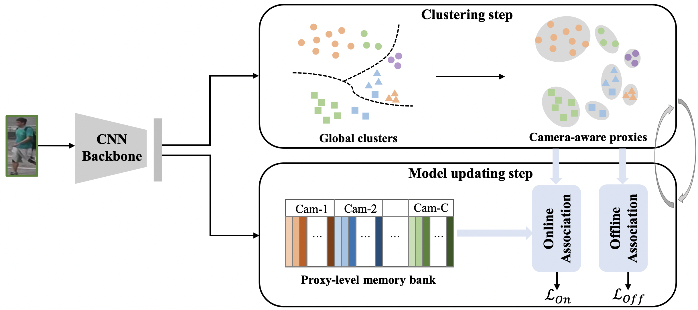
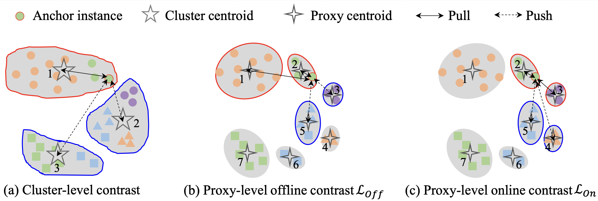
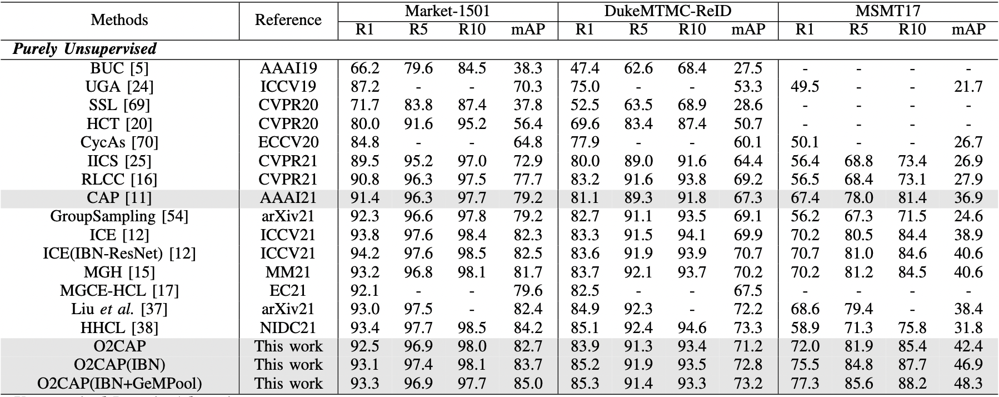

# Offline-Online Associated Camera-Aware Proxies for Unsupervised Person Re-identification

[[Paper]](https://arxiv.org/abs/2201.05820) 

This repository contains the implementation of [Offline-Online Associated Camera-Aware Proxies for Unsupervised Person Re-identification](https://arxiv.org/abs/2201.05820), which extends the previous unsupervised method [CAP](https://ojs.aaai.org/index.php/AAAI/article/view/16381) by considering both offline and online association on camera-aware proxies. O2CAP achieves state-of-the-art performances on unsupervised re-ID task, including person re-ID and vehicle re-ID.




## Requirements

### Environment
Python >= 3.6

PyTorch >= 1.1

faiss == 1.6.3

### Installation

```shell
git clone https://github.com/Terminator8758/O2CAP.git
cd O2CAP
python setup.py install
```

### Prepare Datasets
Download the person datasets DukeMTMC-reID, Market-1501, MSMT17, and the vehicle datasets VeRi-776. Then put them under a folder such as '/folder/to/dataset/'.


## Training

We utilize 1 GPU for training.

To train the model in the paper, run this command (example: train on MSMT17):
```shell
CUDA_VISIBLE_DEVICES=0 python train.py --data_dir '/folder/to/dataset/' --dataset 'MSMT17' --logs_dir 'MSMT_logs'
```


## Result


## Citation
If you find this code useful for your research, please cite our paper
```
@article{2022_o2cap,
    title={Offline-Online Associated Camera-Aware Proxies for Unsupervised Person Re-identification},
    author={Menglin Wang and Jiachen Li and Baisheng Lai and Xiaojin Gong and Xian-Sheng Hua},
    journal={IEEE Transactions on Image Processing},
    year={2022}
}
```
